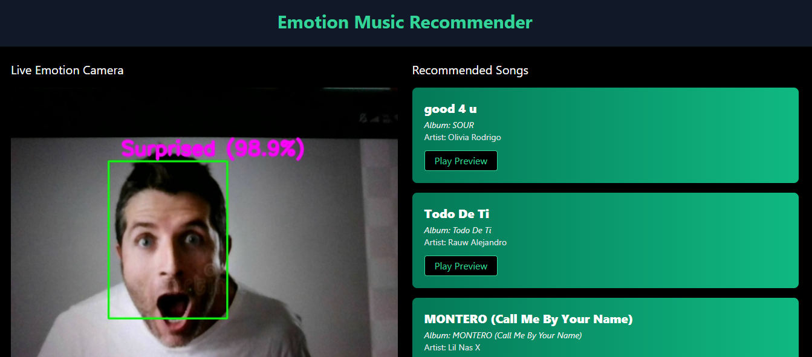
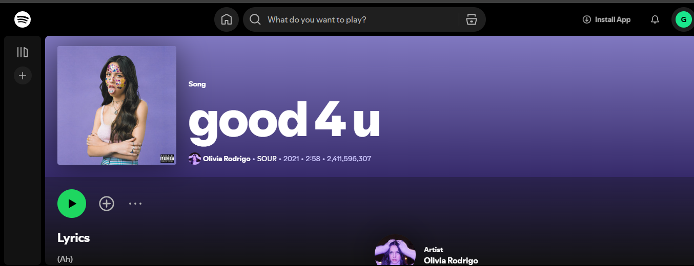

🎧 Emotion-Based Music Recommendation System
This project detects human emotions from facial expressions using DeepFace and recommends music that matches the user's mood, playing the song directly through your Spotify account. It combines computer vision with music intelligence to deliver a personalized audio experience.

🚀 Features
Emotion detection from webcam using DeepFace

-Real-time facial emotion recognition (happy, sad, angry, etc.)

-Emotion-based song recommendation

-Spotify integration for music playback

-Flask-based web application with simple UI

## 📸 Demo Screenshots

### Emotion Detection in Action  

### Spotify Preview of Recommended Song  

🛠️ Tech Stack
Frontend: HTML, CSS, JavaScript

Backend: Python, Flask

Libraries & APIs: DeepFace, OpenCV, Spotipy (Spotify API), Pandas

📦 Setup Instructions
Clone the repository:

git clone https://github.com/Gowthamkumar29/Emotion_based_music_recommendation.git
 cd Emotion_based_music_recommendation
Create a virtual environment (optional but recommended):

python -m venv venv
source venv/bin/activate  # On Windows: venv\Scripts\activate
Install the required packages:

pip install -r requirements.txt
Set up Spotify Developer credentials:

Go to Spotify Developer Dashboard

Create an app and get the Client ID and Client Secret

Create a config.py file and add the following:

SPOTIPY_CLIENT_ID = 'your-client-id'
SPOTIPY_CLIENT_SECRET = 'your-client-secret'
SPOTIPY_REDIRECT_URI = 'http://localhost:8888/callback'
Run the application:
 

You can run the app with a **single command**:

.\run_app.ps1

Visit the app in your browser:

http://127.0.0.1:5000/

Detected Emotions
The system can classify the following emotions:

: Happy😊

: Sad😭

: Angry😡

: Surprise🤯

: Neutral😑

: Fear😱

: Disgust

📚 References
DeepFace Documentation

Spotify Web API

OpenCV Face Detection

🙌 Acknowledgements
Inspired by the intersection of AI and music.

Developed as a personal project for showcasing machine learning + full-stack skills.

